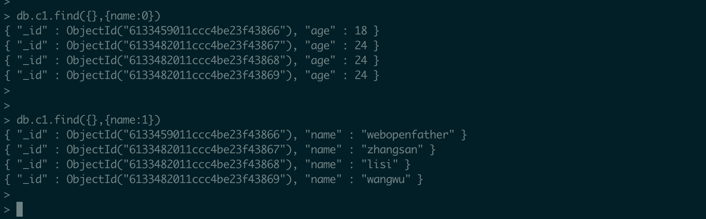
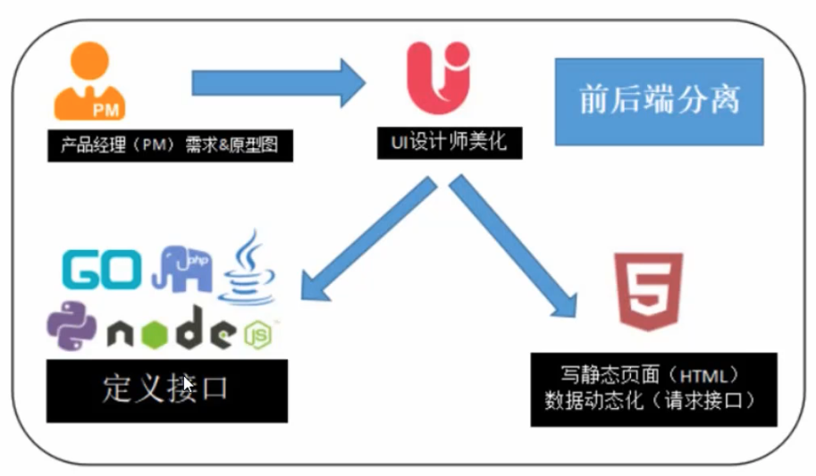
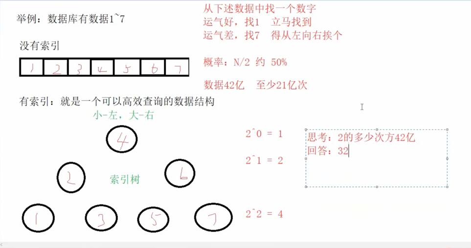
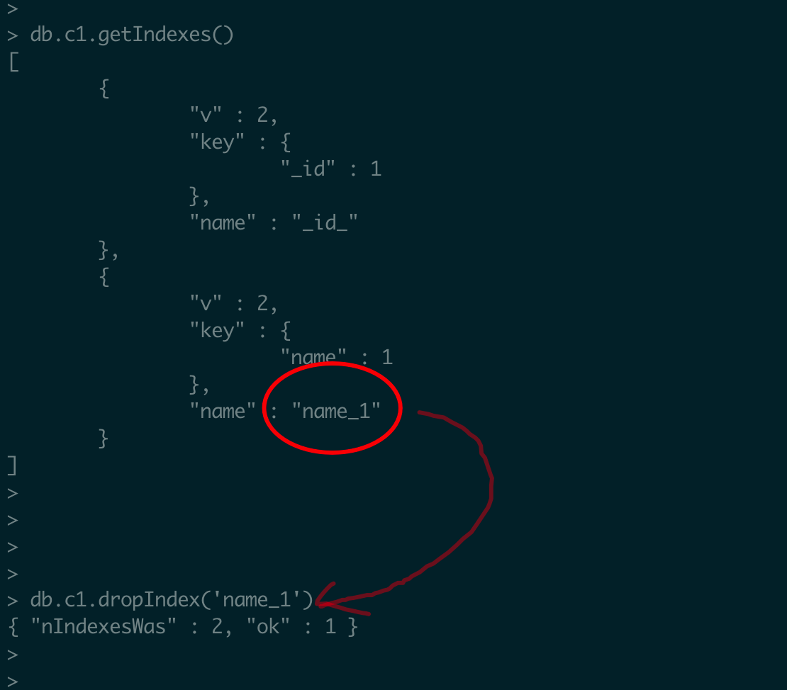
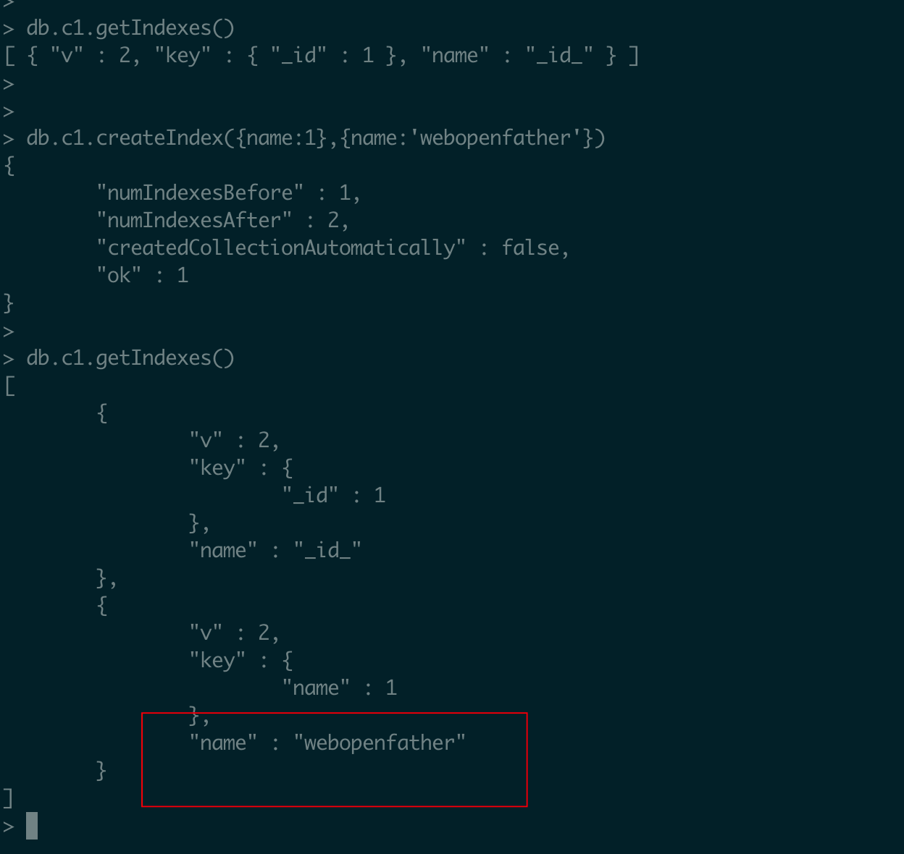
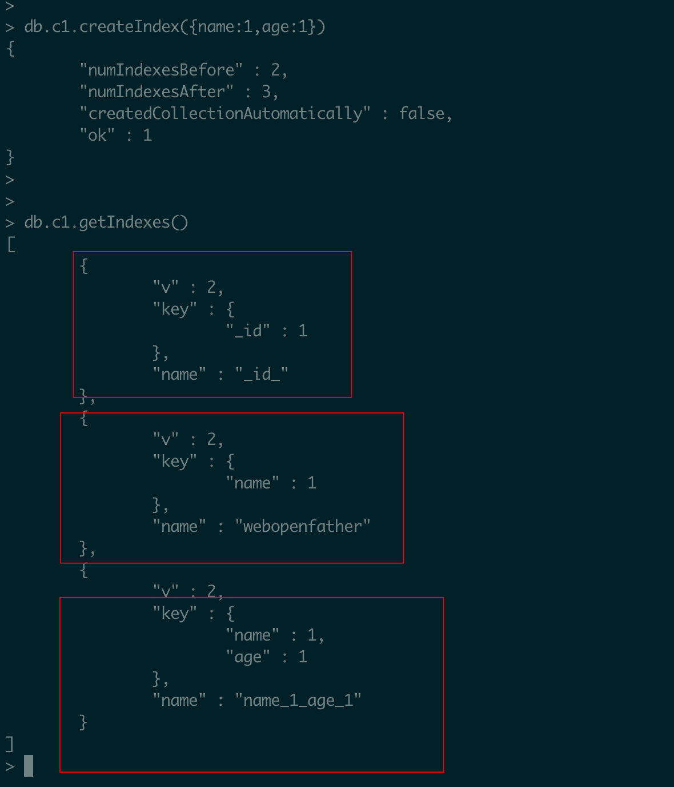
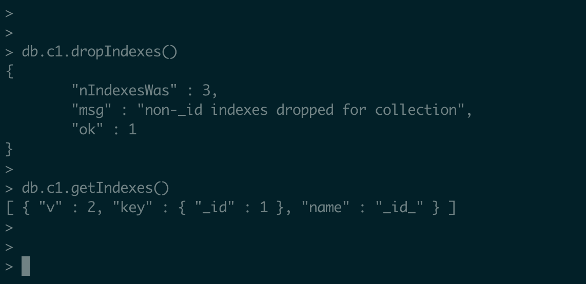
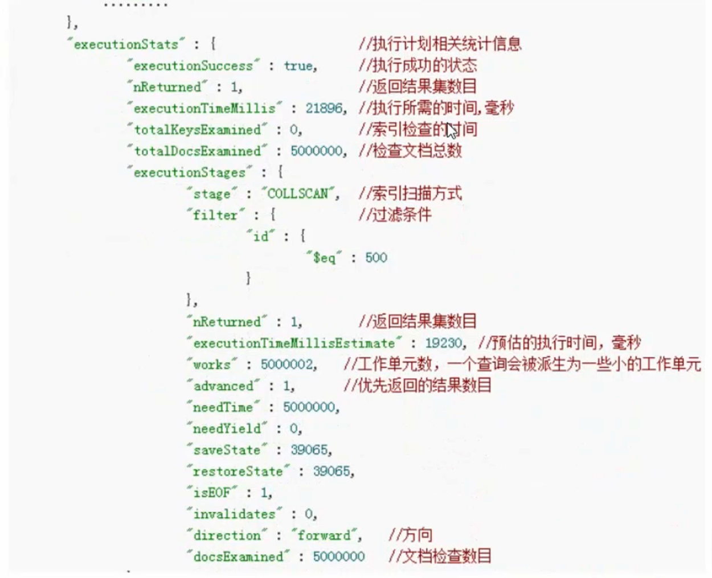

# 1.学习线路

## 1.1 第一章：MongoDB基础

> 数据库简介
>
> MongoDB简介
>
> MongoDB安装
>
> MongoDB基本操作
>
> MongoDB文档增删改查（CURD）
>
> MongoDB实战教学管理系统数据设计

## 1.2 第二章 MongoDB高级 

> MongoDB分页&排序
>
> MongoDB聚合查询
>
> MongoDB优化索引
>
> MongoDB权限机制
>
> MongoDB备份还原
>
> 实战可视化管理工具

## 1.3 第三章：API接口开发

> mongoose简介 （schema & model）
>
> Mongoose 使用
>
> 接口概念
>
> 接口开发规范（RESful API）
>
> 接口测试工具（Postman & Insomnia）
>
> 实战教学管理系统学生模块接口开发
>
> 实战 接口文档开发apiDoc


# 2. 学习目标 

数据库的作用种类

能够独立完成数据库库设计

能够独立完成 MongoDB数据库的CURD

能够实现分页、数据统计、索引、备份等功能

能够使用mongoose开封接管口

能够使用apiDoc开发接口文档

# 3. 数据库简介

 ## 3.1 是什么

数据库使用开存档数据的仓库，数据是按照一定规则进行存放的

## 3.2 类别

### 3.2.1 种类

* 关系型数据库 Oracle、MySQL、 sqlite、SQL Server
* 非关系型数据库（Not Olny Sql）：MongoDB，Redis/Memocache

### 3.2.2 关系型和非关系型数据库软件的去呗

> 相同点：都是数据库软件，用来存放数据
>
> 不同点
>
> ```text
> 关系型：1. 遵循SQL标准，换句话说语法大同小异、2.有库和表达约束等；
> 非关系型：1.没有统一的标准、2.一般以键值对的形式存储；3.读取速度更快
> ```

### 3.2.3 关系型和非关系型数据库软件如何选择

参考文章 ： [ 《阿里云构建千万级别架构演变之路》](https://blog.csdn.net/hliq5399/article/details/75305708)


# 4. MongoDB简介

## 4.1 简介

* 基于分布式文件储存数据库
* C++ 语言编写
* 支持的数据结构非常松散，是类似json 的 bson 格式（后期插入数据改写成json）

> JSON ( javascript object notation, js是对象简谱) 是一种轻量级的数据交换格式，bson (二进制的json)

# 5. MongoDB安装

## 5.1 Mac OSX 平台安装 MongoDB

MongoDB 提供了 OSX 平台上 64 位的安装包，你可以在官网下载安装包。

下载地址：https://www.mongodb.com/download-center#community

## 5.2 使用 curl 命令来下载安装：

* 进入 /usr/local

```shell

cd /usr/local

```

* 下载

```shell
sudo curl -O https://fastdl.mongodb.org/osx/mongodb-osx-ssl-x86_64-4.0.9.tgz
```

* 解压

```shell
sudo tar -zxvf mongodb-osx-ssl-x86_64-4.0.9.tgz
```

* 重命名为 mongodb 目录

```shell
sudo mv mongodb-osx-x86_64-4.0.9/ mongodb
```


* 安装完成后，我们可以把 MongoDB 的二进制命令文件目录（安装目录/bin）添加到 PATH 路径中：

```shell
export PATH=/usr/local/mongodb/bin:*$PATH*
```

* 创建日志及数据存放的目录：

  * 数据存放路径：

    ```shell
    sudo mkdir -p /usr/local/var/mongodb
    ```

  * 日志文件路径：

    ```shell
    sudo mkdir -p /usr/local/var/log/mongodb
    ```

* 接下来要确保当前用户对以上两个目录有读写的权限：

 ```shell
 sudo chown runoob /usr/local/var/mongodb
 
 sudo chown runoob /usr/local/var/log/mongodb
 ```

以上 runoob 是我电脑上对用户，你这边需要根据你当前对用户名来修改。

## 5.3 后台启动 mongodb：

```shell
mongod --dbpath /usr/local/var/mongodb --logpath /usr/local/var/log/mongodb/mongo.log --fork
```

> --dbpath 设置数据存放目录
>
> --logpath 设置日志存放目录
>
> --fork 在后台运行

* 如果不想在后端运行，而是在控制台上查看运行过程可以直接设置配置文件启动：

```shell
mongod --config /usr/local/etc/mongod.conf
```

## 5.4 查看 mongod 服务是否启动：

```shell
ps aux | grep -v grep | grep mongod
```

使用以上命令如果看到有 mongod 的记录表示运行成功。

* 启动后我们可以使用 mongo 命令打开一个终端：

```shell
$ cd /usr/local/mongodb/bin

$ ./mongo

MongoDB shell version v4.0.9

connecting to: mongodb://127.0.0.1:27017/?gssapiServiceName=mongodb

Implicit session: session { "*id*" : UUID("*3c12bf4f-695c-48b2-b160-8420110ccdcf*") }

MongoDB server version: 4.0.9

……

\> 1 + 1

2

\> 
```


## 5.5 停止MongoDB服务

> /usr/local/mongodb/bin/下执行  ./mongo
>
> 执行   use admin
>
> 执行 db.shutdownServer({force:true})

# 6. MongoDB基本操作

基本概念

* 数据库database

* 集合collection

* 数据文档document

## 6.1 查看数据库

语法： show database

效果：

  

## 6.2 选择数据库

语法：use 数据库名称

效果：


【注意】在 MongoDB中选择不存在的数据库不会报错，会先隐式创建，然后切换到相应的数据库中

## 6.3 查看集合

语法：show collections

效果：


##  6.4 创建集合

语法：db.createCollection('stu1')

效果：


## 6.5 删除集合

语法：db.集合名称.drop()

效果：


## 6.6 删除数据库

语法：

1. 选中数据库
2. 使用 db.dropDatabase()

## 小总结

数据库（查看、创建、选择、删除）

​	查看：show database

​	创建：有单独的语法，但是忽略，隐式创建

​	选择： use 数据库名

​	删除：先通过 use 选中数据库，然后通过 db.dropDatabase() 删除数据库

集合（查看、创建、删除）

​	查看 show collections

​	创建 db.createCollection("集合名称")

​	删除 db.集合名称.drop()


# 7. MongoDB文档 增删改查（CURD）

## 7.1 C新增

语法：db.集合名.insert(JSON数据)

说明：集合存在-直接插入数据，集合不存在-隐式创建

练习：在test2数据库的c1集合中插入数据（姓名叫webopenfather年龄18）

```shell
use test2
db.c1.insert({uname:'webopenfather',age:18})
```

效果：


注意:

1. 数据库和集合不存在都是隐式创建
2. 对象的键统一不加引号翻遍看，但是查看集合数据的时候系统会自动加上


思考1：是否可以自定义 _id 的值？

> 回答：可以，只需要给插入的json数据增加 _id 键即可覆盖（但是不推荐在开发中使用）
>
> db.c1.insert({ _id:1, name:"webopenfather", age:18})

思考2：如何插入多条记录？

> 回答：传递数据，数组中写一个个 JSON 数据即可
>
> ```shell
>  db.c1.insert([
>   { name:"zhangsan",age:24},
>   { name:"lisi",age:24},
>   { name:"wangwu",age:24},
> ])
> ```

思考3：如何快速插入10 条数据

> 回答：MongoDB的底层是使用js引擎实现的，所以支持部分的js语法
>
> 因此可以使用 for 循环
>
> ```shell
> for(var i=1; i<=10; i++){
> 	print(i)
> }
> ```
>
> 需求： 在test2数据库c2集合中插入10条数据，分别为a1,a2.....a10
>
> ```shell
> for(var i=1; i<=10; i++){
> 	db.c2.insert({ name:"a"+i,age:20+i},)
> }
> ```

## 7.2 R查询

基础语法：db.集合名.find(条件,[,查询的列])

​	条件

​		查询所有数据							{ } 或者不写 

​		查询 age=6的数据					{ age:6}

​		既要 age=6 又要性别=男		  {age:6,sex:"男"}

​	查询的列

​		不写 										查询全部列（字段）

​		{age:1} 									只显示 age 列（字段）

​		{age:0}										 除了age列（字段）都显示

​	【注意】：不管怎么写系统定义的_id都会存在

升级语法

> db.集合名.find({键：值}) 		注：值不直接写
>
> ​								{运算符：值}
>
> db.集合名.find({
>
> ​	键:{ 运算符：值}
>
> })


**练习1：查询所有数据**

>db.c2.find()



**练习2：查询年龄大于5岁的数据**

>```she
>db.c1.find({age:{$gt:5}})
>```

**练习3：查询年龄是5岁 、8岁、10岁的数据**

>```she
>db.c2.find({age:{$in:[5,8,10]}})
>```
>
>

**练习4：只看年龄列，或者年龄以外的列（_id不管）**

>```she
>db.c2.find({},{age:1})
>
>db.c2.find({},{age:0})
>```

## 7.3 U 修改

**基础语法**： db.集合名.update(条件，新数据[，是否新增，是否修改多条])

> 是否新增：指条件匹配不到的数据则插入，true插入，false表示不插入默认是false
>
> 是否修改多条：指将匹配成功的数据都修改（true是，false否默认）

**升级语法**

> db.集合名.update(条件，新数据)
>
> ​										{修改器：{键：值}}

| 修改器  | 作用     |
| ------- | :------- |
| $inc    | 递增     |
| $rename | 重命名列 |
| $set    | 修改列值 |
| $unset  | 删除列   |

 

**准备工作：**

```shell
use test2
for(var i=1; i<=10; i++){
	db.c3.insert({ uname:'zs'+i, age:i });
}

```

**练习1：将`{ uname: 'zs1'} `改名为` { uname:'zs2' }`**

> ```shell
> db.c3.update({uname:'zs1'},{uname:'zs2'})
> ```
>
> 发现：上边的操作不是修改而是替换，直接将源数据进行替换
>
> 解决：使用升级语法，修改器
>
> 新需求：使用修改器将zs2的姓名改成zs22
>
> ```shell
> db.c3.update({uname:'zs2'},{$set:{uname:'zs22'}})
> ```

**练习2：给 ` { uname:'zs10'}` 的年龄加两岁或者减两岁**

> ```shell
> db.c3.update({uname:'zs10'},{$inc:{age:2}})
> 
> db.c3.update({uname:'zs10'},{$inc:{age:-2}})
> ```
>

**练习3：修改器综合练习 **

插入数据 db.c4.insert({uname:'神龙教主'},age:888,who:'男',other:'非 国人')

完成需求

* Uname 改成webopenfather （修改器：$set）
* age 增加 111 （修改器：$inc）
* who 该字段 sex  (修改器：$rename)
* other 删除   （修改器：$unset）

语法分析

```shell
db.c4.insert({uname:'神龙教主',age:888,who:'男',other:'非国人'})

//注意，这里是多个修改器同时进行修改
db.c4.update({uname:'神龙教主'},{
	$set:{uname:'webopenfather'},
	$inc:{age:111},
	$rename:{who:'sex'},
	$unset:{other:true}
})
```

【练习4】：验证语法最后两个参数（了解）

【验证】是否新增， true新增 false不新增：修改 uname等于zs30的年龄 30 岁

```shell
db.c3.update({uname:'zs30'},{age:30},true)
```

【验证】是否修改多条  true是，false否默认

```shell
db.c3.update({},{$set:{age:10}},false,true)
```

## 7.4 D删除

db.集合名.remove( { }, 是否删除一条)

是否删除一条：true删除一条，false删除多条默认


## 7.5 小总结

## 增 Create

```shell
db.集合名.insert(JSON数据)
```

## 删 Delete

```she
db.集合名.remove(条件,[，是否删除一条 true是 false默认])
```

## 改 Update

```shell
db.集合名.update(条件,新数据,[，是否新增，是否修改多条)
升级语法 db.集合名.update(条件,{修改器:{键:值}})
```

## 查 Read

```she
db.集合名.find(条件，[,查询的列])
```

# 8. MongoDB实战教学管理系统数据设计

## 8.1 实战开发流程



## 8.2数据库设计流程

根据UI设计稿

* 1.确定功能模块所属几个
* 确定集合字段

> UI设计稿每一个展示内容来设计展示字段
>
> 创建于
>
> 更新于
>
> 状态字段
>
>  
>
> 最后：先中文、在英文


## 8.3 练习

【练习】 根据教学系统，设置存放学生信息的结合，并插入20条测试数据

> 集合名称：学生集合
>
> 集合字段：编号、学号、姓名、电话、性别、年龄、学历、备注


```shell
use school

for(var num=1; num<=20; num++){
	db.stu.insert({
		id:num,
		no:'QF'+num,
		uname:'ZSD'+num,
		tel:'13455644484',
		sex:'female',
		age:num,
		school:'研究生',
		remark:'rich man'
	})
}

```


# 9. MongoDB分页&排序

## 9.1 明确需求

点击按钮，实现分页展示功能 

## 9.2 准备

```shell
use test3
db.c1.insert({_id:1,name:'a',sex:1,age:1})
db.c1.insert({_id:2,name:'a',sex:1,age:2})
db.c1.insert({_id:3,name:'b',sex:2,age:3})
db.c1.insert({_id:4,name:'c',sex:2,age:4})
db.c1.insert({_id:5,name:'d',sex:2,age:5})
db.c1.find()
```

## 9.3 排序

* 语法：db.集合名.find().sort(JSON数据)
* 说明：键-就是要排序的列/字段；值：1升序、-1降序
* 练习： 年龄的升序&降序

```shell
db.c1.find().sort({age:1})   //升序
db.c1.find().sort({age:-1})   //降序
```

## 9.4 Limit 与 Skip 方法

* 语法：dn.集合名.find().sort().skip(数字).limit(数字)
* 说明：skip跳过的指定数量（可选），limit限制查询的数量
* 练习：1-降序查询，查询两条；2-降序跳过两条并查询两条

```shell
 db.c1.find().sort({age:-1}).skip(0).limit(1)
 
  db.c1.find().sort({age:-1}).skip(2).limit(1)
```

## 9.5 实战分页

需求:数据库1-10条数据，每页显示两条（5页）

语法：db.集合名.find().skip().limit()

skip 的计算公式：（当前页-1）*每一页现实的条数

```shell
1页   1  2    0
2页   3  4    2
3页   5  6    4
4页   7  8    6
5页   9  10   8
```

## 小总结

db.集合名.find()

.sort({ 列：-1/1}) 排序

.limit( 数字 ) 限制查询条数

.count( ) 统计总数量

不够：百度或谷歌

# 10. MongoDB聚合查询

## 10.1 明确需求

思考：如何统计数据，实现分组数据统计等？

回答：通过MongoDB聚合查询

## 10.2 概念

聚合查询

 顾名思义就是把数据聚合起来然后统计

## 10.3 语法（略复杂）

```shell
db.colname:aggregate([
	{pipe:{expressions}}
])
```

常用管道符

> `$group` 将集合中的文档分组，用于统计结果
>
> `$match` 过滤数据，只要输出符合条件的文档
>
> `$sort`  聚合数据进一步排序
>
> `$skip`  跳过指定文档数
> 
> `$limit` 限制集合数据返回文档数
>
> ...

常用表达式

> `$sum`  总和   `$sum:1` 同count表示统计个数 
>
> `$avg ` 平均值  
>
> `$min`  最小值
>
> `$max`  最大值
>
> ...

## 10.4 准备

```shell
use test4
db.c1.insert({_id:1,name:'a',sex:1,age:1})
db.c1.insert({_id:2,name:'a',sex:1,age:2})
db.c1.insert({_id:3,name:'b',sex:2,age:3})
db.c1.insert({_id:4,name:'c',sex:2,age:4})
db.c1.insert({_id:5,name:'d',sex:2,age:5})
```

## 10.5 练习
* 统计男生、女生的总年龄
```shell
db.c1.aggregate([
  {
    $group:{
      _id:"$sex",
      rs:{ $sum:"$age"}
    }
  }
])
```
 * 统计男生、女生的总人数
```shell
db.c1.aggregate([
  {
    $group:{
      _id:'$sex',
      rs:{ $sum:1 }
    }
  }
])
```
* 求学生总数和平均年龄
```shell
db.c1.aggregate([
  {
    $group:{
      _id:null,
      total_num:{ $sum:1 },
      avg_age:{ $avg:'$age' }
    }
  }
])
```

* 查询男生、女生人数，按升序排列
```shell
db.c1.aggregate([
  {
    $group:{
      _id:'$sex',
      res:{$sum:1}
    }
  },
  {
    $sort:{
      res:1
    }
  }
])

```

# 11. MongoDB优化索引
## 数据库的索引
* 说明：索引是一种排序好的、便于快速查询的数据结构
* 作用: 帮助数据库高效地查询数据

## 索引的优缺点
* 优点
> 提高数据查询的效率，降低数据库的 IO 成本
> 
> 通过索引岁数据进行排序，降低数据排序的成本，降低CPU的消耗
* 缺点
> 占用磁盘空间
> 
> 大量索引印象 SQl 语句效率，因为每一次插入和修改数据都需要更新索引

## 语法
* 创建索引语法 

```shell
db.colName.createIndex(set,others)
```
>参数
> 
> colName | 集合名
> 
> set | 待创建的索引的列 : {键：1，...，键：-1}
> 
> 说明： 1表示升序，-1表示降序 ； 例如 {age:1}表示创建age索引并按照升序的方式进行储存
> 

* 删除索引语法：
> 
> 全部删除：db.集合名.dropIndexes()
> 
> 删除指定：db.集合名.dropIndex(索引名)


* 查看索引语法：db.集合名.getIndexes()


## 练习
**准备：向数据库中新增十万条数据**

```shell
use test5
for( var i=1; i<=1000; i++){
  db.c1.insert({ name:'aaa'+i, age:(i%3)+24})
}
db.c1.count() 
```

**创建普通索引**
> 需求：给 name 添加普通索引
> 
> 练习1：给name添加普通索引，命令：
> 
```shell
db.c1.createIndex({name:1})

db.c1.getIndexes()
```
> 练习2：删除 name索引，命令：
> 
```shell
db.c1.dropIndex(索引名)

//注意这里的索引名可不是上边的索引，而是查询索引之后生成的name字段对应的值
```

> 练习3：给name创建索引并起名 webopenfather
>
```shell
db.c1.createIndex({name:1},{name:'webopenfather'})
```


**创建复合索引**
>需求：给name 和 age 添加组合索引
>说明：就是一次性给两个字段建立索引
>语法：
```shell
db.集合名.createInedex({键:方式一, 键:方式2})

db.c1.createIndex({name:1,age:1})
```



**创建唯一索引**
>需求 ：给name添加普通索引
> 语法：
> db.集合名.createIndexes(待添加索引的列，{ unique:列名 })

> 练习1：删除全部索引，命令：db.data1.dropIndexes();
```shell
db.c1.dropIndexes() //系统生成的还在
```



> 练习2：设置唯一索引,命令：
```shell
db.c1.createIndex({name:1},{unique:true})
```
这里的 unique true表示生成唯一的索引，false不生成默认，
生成之后如果要往该数据库中插入**相同的数据**则失败

 


## 分析索引（explain）
* 语法：db.集合名.find().expalin( 'executionStats')
* 说明：
  
  

COLLSCAN 全表扫描

IXSCAN 索引扫描

FETCH 根据索引去检索 document

* 练习
>测试： age未添加索引的情况
>语法：db.c1.find({age:18}).explain('executionStats')

>测试： age未添加索引的情况
>语法：db.c1.find({age:18}).explain('executionStats') 
> 
索引扫描能够查看没有添加索引和添加了索引之后的区别，添加了索引的更加快捷
## 选择规则（如何选择合适的列创建索引）

* 为常作为 条件、排序、分组的字段建立索引

* 选择唯一性索引  （ps:同值较少如性别字段）

* 选择较小的数据列，为较长的字符串使用前缀索引 （ps：索引文件更小）


# 12. MongoDB权限机制

## 明确需求
发现我们再DOS窗口直接输入命令就能够直接登录数据库
这在实战中均不允许
思考：如何解决
回答

## 语法
```shell
// 创建账号
db.createUser({
    "user": '账号',
    "pwd": '密码',
    "roles": [{
        role: '角色',
        db: '所属数据库'
    }]
})
```

## 角色
* `角色种类`
> 超级用户角色：root
> 
> 数据库用户角色：read、readWrite
> 
> 数据库管理角色：dbAdmin、userAdmin
> 
> 集群管理角色：clusterAdmin、clusterManager、clusterMonitor、hostManager
> 
> 备份恢复角色：backup、restore
> 
> 所有数据库角色：
> 
> * readAnyDatabase、
> 
> * readWriteAnyDatabase、
> 
> * userAdminAnyDatabase、
> 
> * dbAdminAnydDatabase
> 

* `角色说明`

>  root：只在admin数据库中可用。超级账号，超级权限
>
>  read：允许用户读取指定数据库
> 
>  readWrite：允许用户读写指定数据库

## 开启验证模式

```shell
# 步骤1 添加超级管理员

use admin

db.createUser({
    'user': 'admin',
    'pwd': 'admin888',
    'roles': [{
        role: 'root',
        db: 'admin'
    }]
})


# 步骤2 退出卸载服务

bin\mongod --remove

# 注意：DOS窗口必需以管理员身份允许

# 步骤3 重新安装需要输入账号密码的服务(注：在原来安装命令基础上加--auth即可)

bin\mongod --install --dbpath D:\MongoDB\Server\3.4\data --logpath D:\MongoDB\Server\3.4\logs\mongo2.log --auth

# 步骤4 启动服务->登录测试

mongo

show dbs # 默认看不到数据库

# 认证身份
 
方法1  mongo 服务器IP地址:端口/数据库 -u 用户名 -p 密码

方法2  a-先登录 b-选择数据库  c-输入db.auth(用户名,密码)
```


## 通过超级管理员账号登录

## 练习
* 添加用户shop1可以读shop数据库
```shell
# 注意 选择数据库   用户属于数据库

use shop

## shop1

db.createUser({
    'user': 'shop1',
    'pwd': 'admin888',
    'roles': [{
        role: 'read',
        db: 'shop'
    }]
})

## shop2

db.createUser({
    'user': 'shop2',
    'pwd': 'admin888',
    'roles': [{
        role: 'readWriter',
        db: 'shop'
    }]
})

```
* 验证
```shell
mongo localhost:27017/shop -u shop1  -p admin888 #可读不可写
db.goods.find() # 正确执行
db.goods.insert({name: 'zhangsan'}) # 报错
# -------------------------------------------------------
mongo localhost:27017/shop -u shop1  -p admin888 #可读可写
db.goods.find() # 正确执行
db.goods.insert({name: 'zhangsan'}) # 正确执行
```

# 13. MongoDB备份还原
* 语法：
```shell
导入数据库语法：mongorestore -h -port -u -p -d --drop 备份数据目录
导入数据库说明
-h  host 服务器ip地址  （一般不写  默认本机
-port   端口（一般不写 默认27017
-u  user  账号
-p  pwd   密码
-d  database  数据库 （注意：不写还原全部
--drop  先删除数据库再导入，不写则覆盖
 
```

* 练习(还原所有数据)：mongorestore -u admin -p admin888 --drop d:\bak

* 练习(还原指定数据)：mongorestore -u admin -p admin888 -d test --drop d:\bak2\test


# 14. 实战可视化管理工具

## 简介
adminMongo  WEB/PC端口管理网页

Robot 3T  客户端软件   **推荐√**

MongoVUE  客户端软件

# 15. mongoose简介 （schema & model）

## 明确需求
为什么 学习数据库，存放网站的数据

实战中通过程序开实现数据库的操作  ---- mongoose

mongoose能够通过node语法实现MongoDB的增删改查

安装 npm i mongoose 

## schema 

英文网：http://monggoosejs.com

中文网：http://mongoosejs.net

作用，用来约束MongoDB文档数据，（哪些字段是必须的，哪些字段是可选）

## model

一个模型 对应一个几个

通过模型来集中管理数据

## 总结

mongoose 核心概念
> schema 约束字段/列数据
> 
> model  模型对应集合 

# 16. Mongoose 使用
## 安装
步骤1：创建api目录

步骤2: 在api目录下安装mongoose模块

## 语法

* 安装mongoose

```shell
npm i mongoose 
```

在注意要使用 node 11 + 的版本

* 文件结构

```text
api
  |__connect
  |  |__dbConnection.js
  |  |__dbModels.js
  |__controller
     |__c.js
     |__u.js
     |__r.js
     |__d.js  

```

* 链接数据库

`/api/connect/dbConnection.js`

```js
const mongoose = require('mongoose');
const url = 'mongodb://localhost:27017/test5'
const options = {useNewUrlParser:true,useUnifiedTopology:true}

const db = mongoose.createConnection(url,options,(err)=>{
    if(err){
        console.log('数据库连接失败')
        db.close()
        return
    }
    console.log("数据库连接成功")
})

module.exports= db
```

* 创建schema模型

`/api/connect/dbModels.js`

```js
const db = require('./dbConnection');
const model = db.model('api',{
    uname:{type:String,default:'kevinlaizhiyu'},
    pwd:{type:String,default:"lai759728"},
    age:{type:Number},
    sex:{type:String}
})

module.exports = {
    model
}
```

* 使用

`/api/controller/c.js`

```js
const db = require('../connect/dbConnection');
const {model} = require('../connect/dbModels')
const insertData = new model({
    uname:'davidHuang',
    pwd:'456123',
    age:43,
    sex:'Male'
})

insertData.save()
    .then((res)=>{
        console.log('data insert successfully')
        db.close()
        return res
    })
    .catch(err=>{
        console.log('data insert failed')
        throw err
        db.close()
        return
    })


```
# 17. 接口概念 

## 明确需求

随着移动互联网的发展，客户端层出不穷，微信端，WeB/PC、APP等等，而后端的业务逻辑基本是一致的，为了使业务逻辑一次编写随时接入，于是产生的接口规范

## what is api
就是一个文件 （js/json/php等等）主要相应的是JSON 数据（体积小，操作方便）或者XML数据

```json
{
  "status": 1/0,
  "msg":'提示信息'
}
```


# 18. 接口开发规范（RESTful API）

# 19. 接口测试工具（Postman & Insomnia）

# 20 .实战教学管理系统学生模块接口开发

# 21.实战 接口文档开发apiDoc


